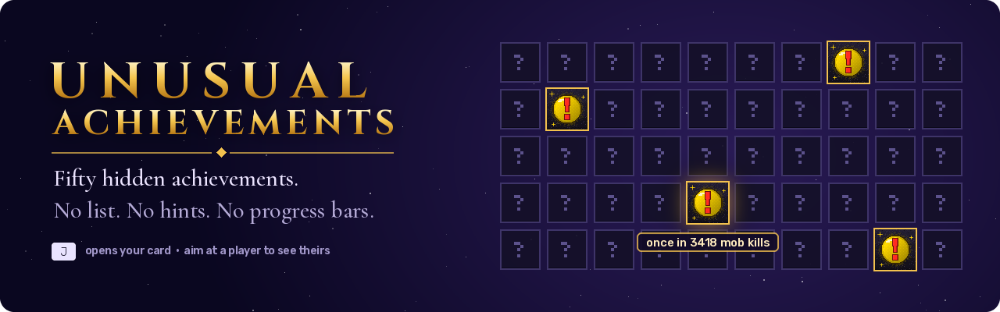
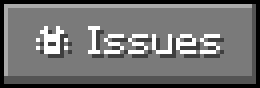

<p align="center">
  
</p>

<p align="center">
  <a href="https://modrinth.com/mod/unusualachivments"></a>
  <a href="https://github.com/Mixaold/UnusualAchievements/issues"></a>
  <a href="https://www.donationalerts.com/r/mixaold"></a>
</p>

<p align="center">
  
  
  
  
</p>

<p align="center"><b>English</b> · <a href="#русский">Русский</a></p>

---

## About

50 hidden achievements. No list, no hints, no progress bars.

Nobody tells you what they are. You do something odd, the game counts it, and only then do you find
out what it was. Most of them you hit by accident.

No chat spam, no window across half the screen. Just a small gold marker by the hotbar that flips into
a red **!**.

## The card

Everything you unlock goes on a card. **J** opens yours. Aim at another player and press it again to
see theirs.

12 card backgrounds, each locked behind one achievement, so a card says something about who is holding
it. The locked ones are shown too, greyed out under a padlock.

Every unlock says how rare it is in your own game — *"once in 3418 mob kills"* — counted from your
vanilla stats.

## Install

Needs [Fabric API](https://modrinth.com/mod/fabric-api). Nothing else.

> [!IMPORTANT]
> Put the jar on **both the client and the server**, same version on both sides — the mod has its own
> network packets, so a client without it cannot open cards and a server without it has nothing to send.

## Settings

`config/unusualachievements.json` (`overlayEnabled` turns the hotbar marker off). The key is rebindable
in Options → Controls, under **Unusual Achievements**.

<details>
<summary><b>For testing — contains spoilers</b></summary>

<br>

`/uadev` lists every achievement with its condition spelled out and force-unlocks entries for testing.
It requires operator permission, and it spoils the entire mod — open it only if you want to know.

</details>

## Build

```
./gradlew build
```

The jar lands in `build/libs/` — the plain one, not `-sources`.

The card backgrounds, the avatar frames and the mod icon are generated PNGs. Regenerate them through
`tools/gen_themes.py`, `tools/gen_frames.py` and `tools/gen_icon.py` (Python + Pillow) rather than
editing the files by hand.

## License

[MIT](LICENSE).

---

<p align="center"><a href="#about">English</a> · <b>Русский</b></p>

## Русский

### О моде

50 скрытых достижений. Ни списка, ни подсказок, ни полосок прогресса.

Никто не скажет, какие они. Ты делаешь что-то странное, игра это засчитывает, и только тогда ты
узнаёшь, что это было. Большинство ловятся случайно.

Никакого спама в чат и окон на пол-экрана. Просто маленький золотой значок у хотбара, который
переворачивается в красный **!**.

### Карточка

Всё открытое ложится на карточку. Своя — на **J**. Наведись на другого игрока и нажми ещё раз —
увидишь его.

12 фонов для карточки, каждый закрыт за одним достижением, так что по карточке видно, что за человек.
Закрытые тоже показаны — серые, под замком.

У каждого достижения написано, насколько оно редкое в твоей игре — *«один раз на 3418 убийств»*, по
обычной ванильной статистике.

### Установка

Нужен [Fabric API](https://modrinth.com/mod/fabric-api). Больше ничего.

> [!IMPORTANT]
> Ставить jar **и на клиент, и на сервер**, одной и той же версии: у мода свои сетевые пакеты, без
> него клиент не откроет карточки, а серверу нечего отдавать.

### Настройки

`config/unusualachievements.json` (`overlayEnabled` выключает значок у хотбара). Клавишу можно
переназначить в «Настройки → Управление», раздел **Необычные достижения**.

<details>
<summary><b>Для проверки — внутри спойлеры</b></summary>

<br>

`/uadev` показывает все достижения с расписанными условиями и выдаёт любое для проверки. Нужны права
оператора, и она раскрывает весь мод целиком — открывай, только если готов узнать.

</details>

### Сборка

```
./gradlew build
```

Готовый jar появится в `build/libs/` — обычный, не `-sources`.

Фоны карточки, рамки аватара и иконка мода — сгенерированные PNG. Правки вносить через
`tools/gen_themes.py`, `tools/gen_frames.py` и `tools/gen_icon.py` (нужны Python и Pillow), а не
редактированием файлов руками.

### Лицензия

[MIT](LICENSE).
